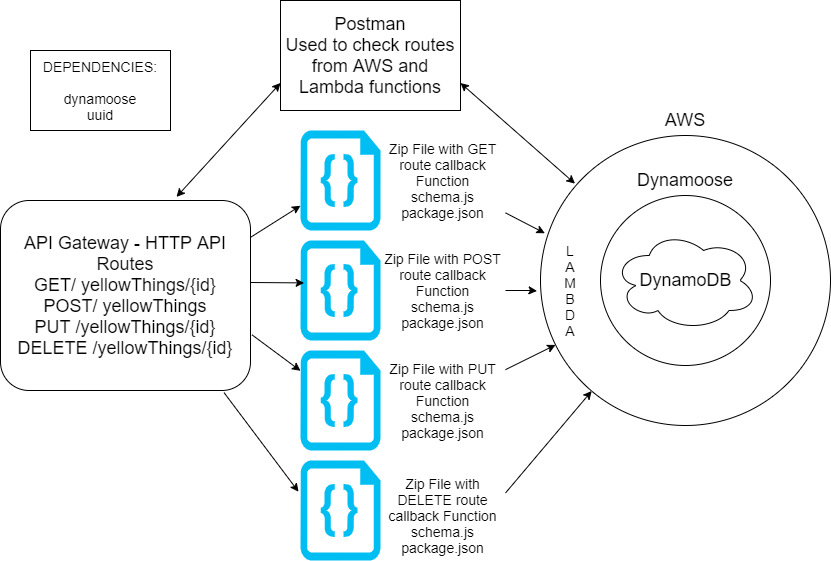

# serverless-api

<!-- What is the root URL to your API?
What are the routes?
What inputs do they require?
What output do they return? -->
Root URL: POSTMAN
```
POST route :
https://anay0prhv3.execute-api.us-west-2.amazonaws.com/yellowThings

body: {"id":"34db5155-d8e9-4c66-ba8d-28a2799c5b27"}
```
```
GET route:
https://anay0prhv3.execute-api.us-west-2.amazonaws.com/yellowThings/{"id":"34db5155-d8e9-4c66-ba8d-28a2799c5b27"}

raw:
{"item": 'banana',
"shade": ['bright yellow'],
"description": 'moldy quickly'
}
body: []
```

+ 